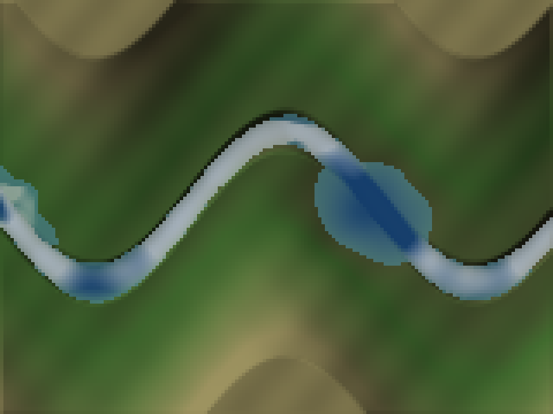

# River solver: `ShallowWater`

2026-09-30 · stacked on the fluids review (`2026-09-30-fluids.md`)

`ShallowWater` simulates rivers, lakes and floods on a terrain heightfield. It grew out of the fluids review: none of the crate's existing fluid models can carry a river, and the grid reviewer reached the same conclusion independently.

## Why a new solver

None of the existing fluid models can carry a river:

| Model | What it is | Why not a river |
|---|---|---|
| `FluidGrid3D` | Incompressible volume grid | No free surface, and it spends its cells on the vertical, which is the one direction nothing happens in over a river's depth. A 200 m × 200 m × 4 m river at 1 m cells is 160k cells, and it still has no surface to render. |
| `SphFluid` | Particles are the fluid | Cost scales with volume. A 200 m river 2 m deep at 0.1 m spacing is tens of millions of particles. |
| `thin_film` | Lubrication law | Viscosity-dominated, for millimetre films. A river is inertia-dominated (Re ≈ 10⁶), with turbulent friction. |

The shallow-water (Saint-Venant) equations assume what is true of a river, that the pressure is hydrostatic and the flow nearly uniform over the depth. They keep three numbers per column of water: the depth and the two horizontal discharges. The water surface is a real 3D heightfield that runs downhill, pools, floods its banks, jumps at weirs and backs up behind dams. The cost scales with the map's area. This is the standard model for rivers in games and in flood engineering alike.

It cannot represent anything that folds over on itself: a breaking wave, the inside of a waterfall, spray. Those are a particle layer (`SphFluid` or the particle effects) spawned where this one says the water is fast or falling.

## The scheme

The scheme is first-order finite volumes:

- **Flux:** an HLL Riemann flux at every face, with Toro's dry-bed wave speeds.
- **Bed slope:** the hydrostatic reconstruction of Audusse et al. (2004).
- **Friction:** Manning's law, applied implicitly.
- **Timestep:** substeps are sized from the fastest wave inside whatever `dt` the frame passes.
- **Threading:** rows run in parallel on grids of 2048 cells or more.

## Tested against exact answers

Every test compares against an exact answer (`src/fluid_dynamics/shallow_water_tests.rs`):

| Property | Oracle | Result |
|---|---|---|
| Well-balanced | A lake at rest over rough ground with 50+ island cells, every boundary type | Currents < 1e-10 m/s and surface within 1e-10 m after 30 s; islands exactly dry |
| Conservative | Closed basin, sloshing hump wetting and drying slopes | Volume drift < 1e-12 relative; exactly zero through walls |
| Metered | Inflow and open outflow | `volume_in − volume_out − total` < 1e-10 relative; inflow exact to 1e-9 |
| Deterministic | Same river on 1 thread, 4 threads and the serial path | Bit-identical depths, discharges, volumes and time |
| Symmetric | x↔z-symmetric setup | Depths agree to 1e-12 |
| Wet dam break | Stoker's exact solution, 2 m onto 0.5 m | L1 < 2% of signal; plateau within 1%; bore within 0.5 m; error falls under refinement |
| Dry dam break | Ritter's exact solution | L1 < 2%; the 5% contour within 3% of its exact position; no negative depth |
| River friction | Manning's normal depth `(qn/√S)^{3/5}` at S = 0.001 and 0.005 | Depth within 1% (measured −0.2% and +0.5%); outflow = inflow to 1e-3 |
| Steep bed | Normal depth at S = 0.02 | 9.6% deep on 10 m cells, 2.4% on 2.5 m, 1.2% on 1.25 m: first-order convergence, and cell size is the cure |
| Smooth steady flow | Bernoulli head over a bump (Goutal–Maurel) | Worst 1.2% on 25 cm cells, 0.6% on 12.5 cm |
| Frame-rate independence | Dam break stepped at 30 Hz vs 144 Hz | Difference < 20% of the scheme's own error |
| Robustness | Thin sheet down a steep dry rough hillside; a velocity of 1e200 | Finite, non-negative and conserved; the runaway is reported as an error |

## Found and fixed while building it

Two defects came out of the Manning test. Both were in the boundaries, and both are the kind that pass every test on flat ground:

- **The open outlet built a backwater that never stopped rising.** On a slope, the cells of a first-order river carry about 1% less discharge than the faces between them. An outlet that copies the edge cell passes only the cell's discharge, so the difference piled up at the mouth. After 12,000 s the depth there was 2.4 m against a normal 1.47 m, and still rising. The outlet now continues the water surface's slope across the edge, capped at the inside level, so a steady river leaves at its own depth and still water stays still.
- **The inflow edge was missing the slope's push.** The first cell sat 6% deep on a 0.5% slope (0.963 m against 0.911 m); it is now within 1%. The inflow depth now continues the surface slope upstream.

## Budget: what rate, what threads

**The design point is presentation, on one worker thread, at 20–30 Hz.** A river is something the player sees and floats things on, not something a fixed-rate simulation tick waits for. Run it off the main loop, step it with the real elapsed time (substepping makes any rate correct), and let the renderer interpolate between the last two states if it draws faster.

One 30 Hz frame on **one thread** (`Threading::Serial`), 1 m cells, a river in steady flow wet from edge to edge. That is the worst case, since dry cells are cheaper. Measured with `cargo bench --bench shallow_water --features fluid_simulation` (group `frame_30hz_one_thread`):

| Grid | Area at 1 m cells | Per 30 Hz frame | Share of one core |
|---|---|---:|---:|
| 64 × 64 | a village stream | 0.51 ms | 1.5% |
| 128 × 128 | | 2.1 ms | 6% |
| 256 × 256 | a quarter-kilometre reach | 8.8 ms | 26% |
| 512 × 512 | half a kilometre | 35 ms | more than a frame: use 2 m cells, or threads |

A real map is mostly dry. The demo valley (160 × 120, 12% wet) costs 2.3 ms per 30 Hz frame on one thread: two substeps for its fastest water, about 7% of a core.

**Threads.** `Threading::Auto`, the default, sweeps rows in parallel on rayon's *current* pool for grids of 2048 cells or more. That is rayon's global pool unless `step` is called inside `pool.install(..)`, which is how a caller bounds or isolates the threads so they do not compete with a renderer's own. `Threading::Serial` keeps every sweep on the calling thread. The result is the same bits either way (tested on 1 and 4 threads, the internal serial path and the public switch), and nothing is allocated after construction.

For comparison, on 4 threads at 60 Hz (group `frame_60hz`): 0.23 ms at 64², 0.74 ms at 128², 2.5 ms at 256², and 9.8 ms at 512².

At 512² the solver is memory-bound on its face-flux buffers, about 20 MB. Replacing divisions with reciprocals gained 5% at 256² and nothing at 512², so it was not kept. The next steps are, in order:

1. Fuse the flux and update sweeps, so each face is used as soon as it is computed and never written out.
2. The GPU port.

## In the game

`bevy_visual_tests/src/bin/river_3d.rs` is a 160 m × 120 m valley on 1 m cells. A river enters at 25 m³/s, winds down the valley, fills a hollow into a lake and leaves at the east edge. Logs float on `sample()`'s surface and current. The demo keys:

- **C** blasts a crater under the river (`set_bed`).
- **F** quadruples the inflow for 15 s.
- **T** bursts a 3000 m³ tank on the hillside.

Run headless, the river reaches the mouth in about 2 minutes. By 12 minutes it is steady, with exactly the 25 m³/s inflow leaving, a 2.7 m lake and a 2.6 m channel at 1.8 m/s. The demo steps it with `Threading::Serial`, as a game would.

## Limits and next steps

- **First order.** Fronts smear over a few cells. A second-order MUSCL reconstruction with Heun time stepping would roughly halve the cells needed for the same sharpness at about twice the cost per cell.
- **Steep, thin flow is under-driven** where the bed falls more than the water is deep within one cell. Finer cells fix it (see the table above).
- **The cell-average discharge on a slope reads about 1% below the true flux** at first order. The face fluxes, which are what move water, are exact.
- **A GPU port is straightforward.** Every face flux and every cell update is local, so the scheme maps one-to-one onto two compute passes. That is the route to kilometre maps at 1 m cells.

## Validation

With the fluids review (#27) beneath it:

| Command | Result |
|---|---|
| `cargo test --features all` (CI) | lib 1163 passed, 0 failed; doctests 241 passed |
| `cargo test` (default features, CI) | lib 651 passed, 0 failed; doctests 138 passed |
| `cargo test --lib`, `fluid_simulation` only | 778 passed, 0 failed |
| `cargo test --lib --features fluid_simulation shallow_water` | 18 passed |
| `cargo check -p bevy_visual_tests --bins` | clean, including `river_3d` |
| `cargo check -p rs_physics_wasm` | clean |
| `cargo bench --features all --no-run` | clean, including `shallow_water` (`frame_60hz`, `frame_30hz_one_thread`) |
